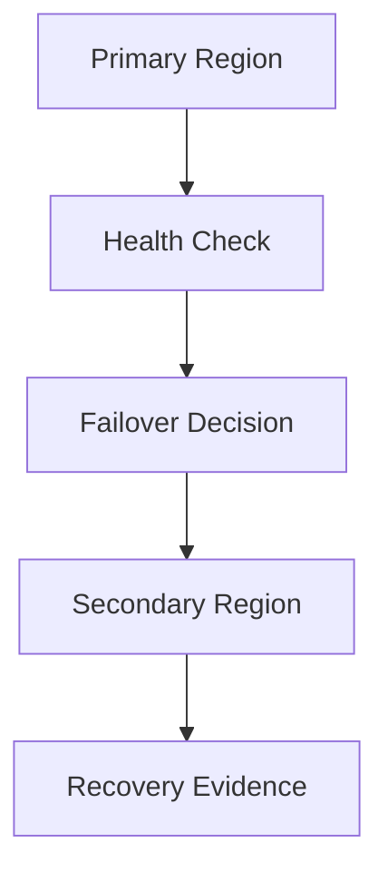

# Multi-Region Disaster Recovery Platform

A resilience engineering project that demonstrates how to design, document and validate an active/passive disaster recovery platform with clear RTO/RPO targets.

## Problem

Many cloud systems have backups but no tested recovery workflow. This project focuses on the operational side of resilience: what fails, how traffic moves, how data recovery is verified, and what evidence proves the recovery path works.

## Architecture



## What This Project Demonstrates

- RTO/RPO-based recovery planning.
- Active/passive multi-region design.
- Infrastructure-as-code recovery strategy.
- Failover runbook creation.
- Cost-controlled disaster recovery design with reusable validation evidence.

## Repository Structure

| Path | Purpose |
| --- | --- |
| `terraform/` | DR strategy outputs and region variables. |
| `runbooks/` | Step-by-step failover procedure. |
| `docs/evidence/` | Validation summary and evidence notes. |

## Validation

```powershell
powershell -ExecutionPolicy Bypass -File scripts/validate.ps1
```

## Cost Control

This project uses a controlled validation model: recovery architecture, runbooks and evidence are maintained from code while cost exposure is kept under control.

## Engineering Talking Points

- Difference between backup and recoverability.
- How RTO/RPO shape architecture and cost.
- Why runbooks matter during incidents.
- What evidence proves a recovery workflow is real.
