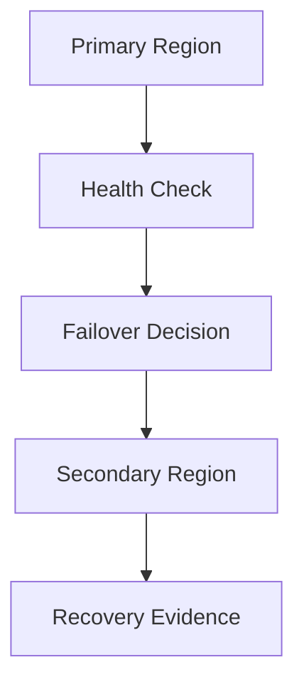

# Multi-Region Disaster Recovery Platform

A resilience engineering project that demonstrates how to design, document and validate an active/passive disaster recovery platform with clear RTO/RPO targets.

## Problem

Many cloud systems have backups but no tested recovery workflow. This project focuses on the operational side of resilience: what fails, how traffic moves, how data recovery is verified, and what evidence proves the recovery path works.

## Architecture



## What This Proves

- RTO/RPO-based recovery planning.
- Active/passive multi-region design.
- Infrastructure-as-code recovery strategy.
- Failover runbook creation.
- Cost-aware disaster recovery without always-on duplicate compute.

## Repository Structure

| Path | Purpose |
| --- | --- |
| `terraform/` | DR strategy outputs and region variables. |
| `runbooks/` | Step-by-step failover procedure. |
| `docs/evidence/` | Validation summary and evidence notes. |

## Validation

```bash
cd terraform
terraform init -backend=false
terraform validate
```

## Cost Control

The design avoids permanent standby compute for portfolio validation. A live test should use minimal temporary resources, collect evidence, then destroy resources immediately.

## Interview Talking Points

- Difference between backup and recoverability.
- How RTO/RPO shape architecture and cost.
- Why runbooks matter during incidents.
- What evidence proves a recovery workflow is real.
