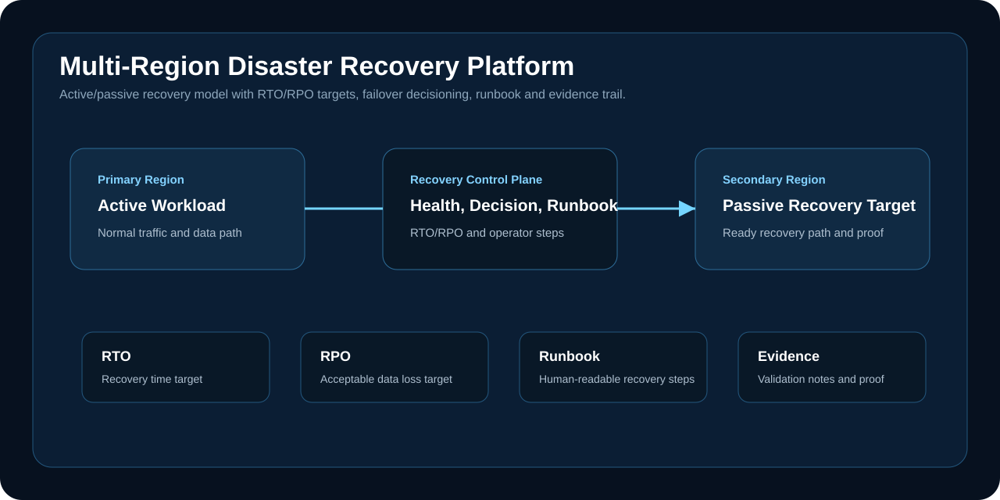

# Multi-Region Disaster Recovery Platform

A resilience engineering project that demonstrates how to design, document and validate an active/passive disaster recovery platform with clear RTO/RPO targets.



## Executive Summary

This project focuses on recoverability, not only backups. It documents the operating path for detecting regional failure, deciding when to fail over, recovering service in a secondary region, validating the recovery path and preserving evidence.

## Problem

Many cloud systems have backups but no tested recovery workflow. During an incident, the missing parts are usually ownership, decision criteria, data-loss expectations, rollback steps and proof that the recovery path has been exercised.

## Engineering Scope

| Area | Implementation |
| --- | --- |
| Recovery model | Active/passive regional design |
| Objectives | RTO/RPO language and trade-off notes |
| Infrastructure | Terraform outputs and region variables |
| Operations | Failover runbook with operator steps |
| Evidence | Validation summary and local validation log |
| Cost control | Architecture and proof maintained from code without always-on duplicate spend |

## Repository Structure

| Path | Purpose |
| --- | --- |
| `terraform/` | DR strategy outputs and region variables |
| `runbooks/failover.md` | Step-by-step failover procedure |
| `scripts/validate.ps1` | Validation checks |
| `docs/evidence/` | Validation summary and evidence notes |
| `docs/adr/` | Architecture and recovery decisions |
| `assets/` | Architecture visual used in the README |

## Validation

```powershell
powershell -ExecutionPolicy Bypass -File scripts/validate.ps1
```

## Production Expansion Path

- Add health checks tied to DNS failover or traffic manager.
- Add backup replication and restore testing for the selected data tier.
- Define incident commander, approver and rollback responsibilities.
- Schedule recovery exercises and retain evidence per environment.
- Track RTO/RPO performance after each exercise.

## Evidence Index

- Recovery objectives and region model: `terraform/main.tf`
- Failover procedure: `runbooks/failover.md`
- Failure-domain architecture: `docs/architecture.md`
- Validation summary: `docs/evidence/validation-summary.md`
- Recovery decision: `docs/adr/0001-active-passive-recovery.md`

## Engineering Rationale

The key distinction is between backup and recoverability. A backup is an asset; a recovery capability also requires explicit decision criteria, ownership, a failover procedure, service and data verification, rollback conditions and retained evidence.

## Tradeoffs and Boundaries

Active/passive recovery reduces standing cost compared with active/active operation, but it increases dependence on detection, decision speed, data-freshness checks and a disciplined failover process. The repository demonstrates the recovery operating model and validation logic without claiming a permanently funded secondary production stack.

## Status

Validated as a cost-controlled disaster recovery design with reusable infrastructure, runbook and evidence artifacts.