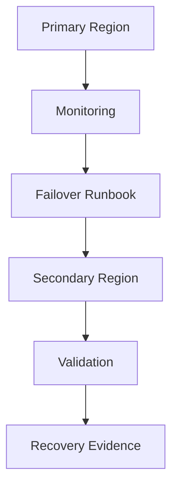

# Architecture

## Design Notes

The project separates normal operation from recovery operation. The goal is not only to create backup resources, but to prove the service can be restored within a defined RTO and RPO.

## Production Extension

A production version would add automated health checks, traffic-manager routing, backup policy enforcement, restore testing, DNS TTL controls and post-incident review templates.
